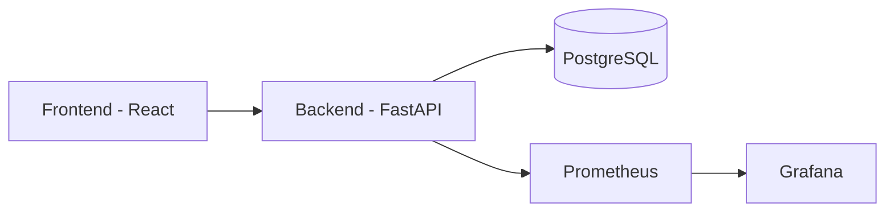

# Sistema de Gestión de Inventario

[](https://github.com/borjar3n/devops-pipeline/actions/workflows/ci-cd.yml)
[](https://sonarcloud.io/summary/new_code?id=borjar3n_devops-pipeline)
[](https://sonarcloud.io/summary/new_code?id=borjar3n_devops-pipeline)

Sistema de gestión de inventario construido con FastAPI y React, implementando un pipeline completo de DevOps.

## 🚀 Características

- ✨ Frontend moderno con React y Material-UI
- 🔥 Backend robusto con FastAPI
- 📊 Monitorización con Prometheus y Grafana
- 🔄 Pipeline CI/CD completo
- 🐳 Containerización con Docker
- 📈 Análisis de código con SonarCloud
- ☁️ Despliegue en AWS

## 🛠️ Tecnologías Utilizadas

### Frontend
- React 18
- Material-UI
- Axios
- Vite
- Vitest para testing

### Backend
- Python 3.11
- FastAPI
- SQLAlchemy
- PostgreSQL
- Pytest

### DevOps
- Docker & Docker Compose
- GitHub Actions
- SonarCloud
- AWS EC2
- Prometheus & Grafana

## 🏗️ Arquitectura



## 🚦 Requisitos Previos

- Docker y Docker Compose
- Node.js 18+
- Python 3.11+
- Cuenta AWS (para despliegue)
- Cuenta Docker Hub

## 🔧 Instalación y Uso Local

1. **Clonar el repositorio**
```bash
git clone https://github.com/borjar3n/devops-pipeline.git
cd devops-pipeline
```

2. **Configurar variables de entorno**
```bash
# Backend
cd backend
cp .env.example .env
# Editar .env con tus configuraciones

# Frontend
cd frontend
cp .env.example .env
```

3. **Iniciar con Docker Compose**
```bash
docker-compose up -d
```

La aplicación estará disponible en:
- Frontend: http://localhost:80
- Backend: http://localhost:8000
- Grafana: http://localhost:3000

## 🧪 Tests

### Backend
```bash
cd backend
pip install -r requirements.txt
pytest
```

### Frontend
```bash
cd frontend
npm install
npm run test
```

## 📦 Estructura del Proyecto

```
/
├── backend/
│   ├── src/
│   │   ├── main.py
│   │   ├── models.py
│   │   └── database.py
│   ├── tests/
│   └── Dockerfile
├── frontend/
│   ├── src/
│   ├── tests/
│   └── Dockerfile
├── monitoring/
│   └── prometheus/
├── .github/workflows/
└── docker-compose.yml
```

## 🚀 Pipeline CI/CD

El pipeline incluye:
1. Tests automatizados
2. Análisis de código
3. Construcción de imágenes Docker
4. Despliegue automático

## 📊 Monitorización

### Métricas Disponibles
- Rendimiento de API
- Uso de recursos
- Métricas de negocio
- Estado del sistema

### Dashboard
- Grafana: http://localhost:3000
- Usuario por defecto: admin
- Contraseña por defecto: admin

## 🌐 API Endpoints

### Productos
- `GET /products/` - Listar productos
- `POST /products/` - Crear producto
- `GET /products/{id}` - Obtener producto
- `PUT /products/{id}` - Actualizar producto

### Movimientos
- `POST /movements/` - Registrar movimiento
- `GET /metrics/monthly-movements` - Obtener movimientos mensuales

## 🔐 Seguridad

- CORS configurado
- Variables de entorno seguras
- Secretos en GitHub Actions
- Grupos de seguridad AWS

## 📝 Guía de Contribución

1. Fork del repositorio
2. Crear rama feature (`git checkout -b feature/AmazingFeature`)
3. Commit cambios (`git commit -m 'Add some AmazingFeature'`)
4. Push a la rama (`git push origin feature/AmazingFeature`)
5. Abrir Pull Request

## 🚨 Solución de Problemas Comunes

### Error en Conexión a Base de Datos
```bash
# Verificar logs
docker-compose logs db

# Verificar conexión
docker-compose exec db pg_isready
```

### Error en Tests
```bash
# Limpiar cache de pytest
pytest --cache-clear

# Ver cobertura detallada
pytest --cov=src tests/ --cov-report=term-missing
```

## 📄 Licencia

Este proyecto está bajo la Licencia MIT - ver el archivo [LICENSE.md](LICENSE.md) para detalles

## 👥 Autores

- **Francisco De Borja Arenas Conde Bandres** - *Trabajo Inicial* - [borjar3n](https://github.com/borjar3n)

## 🙏 Reconocimientos

- FastAPI por el excelente framework
- React por la biblioteca frontend
- GitHub Actions por el sistema CI/CD
- AWS por la infraestructura cloud
